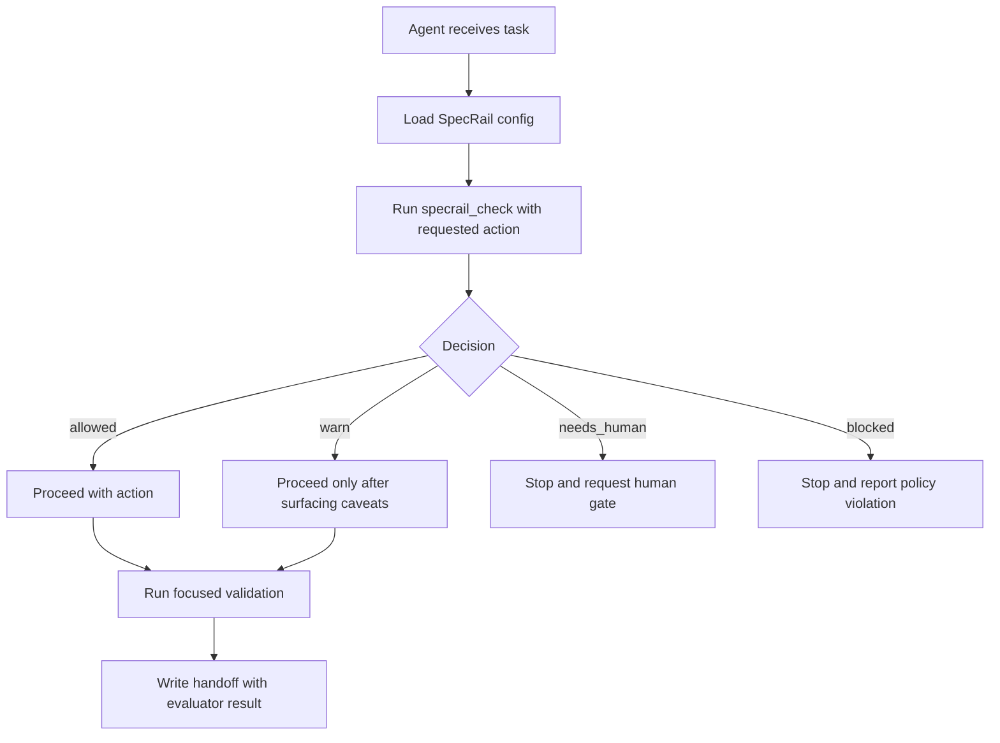

# Tech Spec: Configurable Agent Workflow Evaluator

## Linked Issue

GH-1: https://github.com/majiayu000/specrail/issues/1

## Context

This spec implements the behavior in `product.md` by turning SpecRail's current workflow assets into a policy-driven evaluator for agents.

Relevant current files:

- `README.md:5` describes SpecRail as a portable process library, not a bot or agent runtime.
- `README.md:41` describes adoption as copy/install, run deterministic checks, start in dry-run, and only add automation after trust.
- `README.md:51` states that agents may suggest, draft, review, and diagnose while humans own readiness labels, security decisions, final approval, merge, and release.
- `SPEC.md:31` defines the current state model from `new_issue` through spec, implementation, review, merge, and release-note drafting.
- `SPEC.md:56` defines agent boundaries, including allowed drafting/review actions and forbidden final approval, merge, security disclosure, permission changes, and readiness bypass.
- `workflow.yaml:15` defines `automation_policy`, currently as static lists of allowed and forbidden agent actions.
- `workflow.yaml:39` defines artifact path templates for spec packets, agent reviews, and triage results, currently using fixed `specs/GH{issue_number}/...` paths.
- `states.yaml:1` defines canonical states and transitions, but does not currently describe which actions are allowed from which states.
- `labels.yaml:2` defines label groups, but does not currently map repository-specific label strings to canonical states in a way an evaluator can consume.
- `schemas/pr_review_gate.schema.json:1` defines a PR review gate schema, but hard-codes `ready_to_implement` as the only accepted readiness value.
- `checks/check_workflow.py:12` validates that the workflow pack itself is complete, and `checks/check_workflow.py:122` validates that a spec directory contains `product.md` and `tech.md`. It does not evaluate issue, spec, or PR state against configured policy.

The main design constraint is that checks should be deterministic while policy remains configurable. Code should be a policy interpreter, not the policy owner.

## Proposed Changes

### 1. Add an action policy layer

Extend `workflow.yaml` or add a new `actions.yaml` file. Prefer `actions.yaml` if the config becomes long enough to keep `workflow.yaml` focused on pack metadata.

Initial shape:

```yaml
version: 1

modes:
  default: dry_run
  allowed:
    - dry_run
    - advisory
    - required

actions:
  write_spec:
    allowed_from:
      - ready_to_spec
    required_artifacts:
      - product_spec
      - tech_spec
    human_gates:
      - readiness_label
    agent:
      allowed: true
      forbidden_results:
        - spec_approval

  implement:
    allowed_from:
      - ready_to_implement
    required_artifacts:
      - linked_issue
    human_gates:
      - readiness_label
    agent:
      allowed: true
      forbidden_results:
        - merge
        - final_approval

  review_pr:
    allowed_from:
      - impl_pr_open
      - agent_review
    required_artifacts:
      - linked_issue
      - verification
    human_gates:
      - final_pr_review
    agent:
      allowed: true
      forbidden_results:
        - final_approval
```

This file defines which states permit each action, which artifacts are required, and which results remain human-only.

### 2. Add configurable artifact definitions

Extend artifact configuration so path conventions are not embedded in Python:

```yaml
artifacts:
  linked_issue:
    source: input
    required: true

  product_spec:
    path_template: specs/{work_id}/product.md
    aliases:
      - specs/{work_id}/PRODUCT.md

  tech_spec:
    path_template: specs/{work_id}/tech.md
    aliases:
      - specs/{work_id}/TECH.md

  verification:
    source: input_or_file
    path_template: artifacts/verification/{work_id}.json
```

Keep the default pack's existing lowercase `product.md` and `tech.md` behavior for backward compatibility. Allow overlays to choose uppercase names or alternate roots.

### 3. Add label-to-state mapping

Extend `labels.yaml` with a mapping from repository label strings to canonical states:

```yaml
state_labels:
  ready_to_spec:
    - ready-to-spec
    - ready_to_spec
  ready_to_implement:
    - ready-to-implement
    - ready_to_implement
  needs_info:
    - needs-info
```

The evaluator should infer current state from canonical state inputs first, then from labels when labels are provided. If multiple labels map to conflicting states, return `blocked` with a configuration/evidence conflict.

### 4. Introduce a shared evaluator module

Add `checks/specrail_eval.py` as the deterministic core. It should not call GitHub, mutate files, or inspect git state by itself. It accepts:

- loaded workflow/action/label/artifact config
- requested action
- evidence object
- optional repository root
- mode override

Suggested internal types:

```python
Decision = Literal["allowed", "warn", "needs_human", "blocked"]

@dataclass
class EvaluationInput:
    action: str
    mode: str | None
    state: str | None
    labels: list[str]
    issue: int | None
    pr: int | None
    work_id: str | None
    artifacts: dict[str, Any]
    repo: Path

@dataclass
class EvaluationResult:
    action: str
    decision: Decision
    current_state: str | None
    reasons: list[str]
    satisfied: list[str]
    missing: list[str]
    human_gates: list[str]
    next_allowed_actions: list[str]
```

The evaluator applies rules in this order:

1. Parse and validate config.
2. Enforce universal safety boundaries.
3. Infer current state.
4. Load action policy.
5. Check allowed states.
6. Check required artifacts.
7. Check human gates.
8. Apply mode-specific decision severity.
9. Return a structured result.

### 5. Replace separate hard-coded scripts with one CLI

Add `checks/specrail_check.py`:

```sh
python3 checks/specrail_check.py --repo . --action write_spec --issue 123 --labels ready-to-spec --work-id gh-123
python3 checks/specrail_check.py --repo . --action implement --issue 123 --labels ready-to-implement --work-id gh-123
python3 checks/specrail_check.py --repo . --action review_pr --pr 456 --evidence artifacts/pr-456.json --json
python3 checks/specrail_check.py --repo . --artifact spec_packet --work-id configurable-agent-workflow-evaluator
```

The older conceptual checks can be documented as aliases later if useful, but the first implementation should keep one evaluator path.

Exit-code behavior:

- `0`: `allowed`, or `warn` in `dry_run`/`advisory`.
- `1`: `blocked`, or configured required gate failure.
- `2`: malformed input, unreadable config, or evaluator error.

### 6. Keep `check_workflow.py` as pack validation

Do not overload `checks/check_workflow.py`. Keep it responsible for validating that a SpecRail pack is structurally complete. It may later validate that action-policy config is parseable, but it should not evaluate a specific issue or PR.

### 7. Add schemas for action policy and evaluation result

Add:

- `schemas/action_policy.schema.json`
- `schemas/evaluation_result.schema.json`

These schemas let agents and CI verify both config and JSON output without depending on prose.

Migrate `schemas/pr_review_gate.schema.json` so it no longer hard-codes `ready_to_implement` as the only valid readiness value. The PR gate schema should either:

- reference configured readiness states by name without enumerating a single allowed value, or
- accept a configured canonical state plus a separate validator check that confirms the state is valid for the requested action.

Keep backward compatibility for the default pack by configuring `ready_to_implement` as the default implementation-ready state rather than embedding it in the schema.

`evaluation_result` should require:

- `action`
- `decision`
- `current_state`
- `reasons`
- `satisfied`
- `missing`
- `human_gates`
- `next_allowed_actions`

### 8. Add a Codex-facing workflow skill after manual validation

After the evaluator works on manual examples, add a bundled skill under a separate installable path, for example:

```text
skills/specrail-workflow/
  SKILL.md
  references/routing.md
  references/artifact-contracts.md
  scripts/specrail_check.py
```

The skill should instruct Codex to run the evaluator during preflight and before changing workflow state. It should not duplicate all schema details in `SKILL.md`; detailed policy belongs in references and scripts.

### 9. Separate evaluator severity from workflow run mode

Existing `schemas/workflow_run.schema.json` modes describe what an automation run is allowed to do, such as `dry_run`, `comment_only`, `write_labels`, or `implementation`. The evaluator modes in this spec describe how strictly a decision is enforced for the current check. Do not replace the workflow-run modes.

Use two separate fields:

```yaml
workflow_run_mode: dry_run | comment_only | write_labels | implementation
evaluator_enforcement: dry_run | advisory | required
```

The relationship is:

- `workflow_run_mode` controls side effects.
- `evaluator_enforcement` controls whether missing policy evidence is reported only, warned, or treated as a blocking failure.
- Universal safety boundaries block regardless of both fields.

For example, a repository can run `workflow_run_mode: comment_only` with `evaluator_enforcement: required` to post comments but fail the check when a configured human gate is missing.

### 10. Add localized presentation support

Add a presentation layer that localizes human-facing text without changing machine-facing protocol identifiers.

Configuration:

```yaml
presentation:
  default_locale: en-US
  supported_locales:
    - en-US
    - zh-CN
  fallback_locale: en-US
```

Suggested files:

```text
locales/
  en-US/messages.yaml
  zh-CN/messages.yaml
templates/
  en-US/
    issue_bug.md
    issue_feature.md
    product_spec.md
    tech_spec.md
    pull_request.md
  zh-CN/
    issue_bug.md
    issue_feature.md
    product_spec.md
    tech_spec.md
    pull_request.md
```

Keep the current root-level `templates/*.md` files as the default pack templates for backward compatibility. Localized template directories are optional overlays; when a localized file is missing, resolve in this order:

1. requested locale template
2. configured fallback locale template
3. current root-level template

Evaluator JSON should keep stable codes and include localized display text:

```json
{
  "decision": "needs_human",
  "messages": [
    {
      "code": "missing_readiness_label",
      "message": "缺少人工确认的 readiness 标签，agent 不能继续实现。"
    }
  ]
}
```

Do not translate these values:

- action IDs such as `write_spec`
- state IDs such as `ready_to_spec`
- decision values such as `needs_human`
- artifact IDs such as `product_spec`
- schema keys and file names used by machine consumers
- command names and CLI flags

Locale selection should use this order:

1. explicit CLI flag, for example `--locale zh-CN`
2. explicit agent input
3. `presentation.default_locale`
4. fallback locale

The Codex-facing skill should add a simple rule: when the user writes Chinese or the repo default locale is `zh-CN`, write issue bodies, PR bodies, summaries, and handoffs in Chinese while keeping stable IDs, paths, commands, and JSON keys unchanged.

## End-to-End Flow



## Testing and Validation

Map to `product.md` behavior:

- Behavior 1-4: unit-test evaluator decisions for each initial action and each decision value.
- Behavior 5: test missing labels, missing artifacts, missing CI evidence, and unreadable metadata. Assert missing data never returns silent success.
- Behavior 6: test universal safety boundaries independently of repository policy.
- Behavior 7-8: test custom label names and custom spec path templates.
- Behavior 9: test `dry_run`, `advisory`, and `required` mode exit-code behavior.
- Behavior 10-13: add fixture-based tests for `write_spec`, `implement`, `review_pr`, and `fix_ci`.
- Behavior 14: test both text output and stable JSON output.
- Behavior 16-19: test locale selection, `zh-CN` messages, stable untranslated IDs, and fallback when a localized message or template is missing.
- Behavior 20: run all evaluator unit tests without network access.
- Behavior 21: test malformed config, unknown states, conflicting labels, and impossible transitions.
- Behavior 22: test that default config stays generic and repository-specific examples live in example overlays.

Validation commands for the implementation PR:

```sh
python3 checks/check_workflow.py --repo .
python3 checks/specrail_check.py --repo . --action write_spec --labels ready-to-spec --work-id configurable-agent-workflow-evaluator --json
python3 checks/specrail_check.py --repo . --action write_spec --labels ready-to-spec --work-id configurable-agent-workflow-evaluator --locale zh-CN --json
python3 -m unittest discover -s checks -p '*test*.py'
```

If the implementation chooses `pytest`, document that dependency and run the equivalent focused test command.

## Rollback Plan

The initial implementation should be additive. If the evaluator produces noisy or incorrect results, maintainers can:

1. Keep existing `checks/check_workflow.py` as the authoritative pack validator.
2. Disable evaluator usage by leaving `evaluator_enforcement` unset or set to `dry_run`.
3. Disable localized presentation by omitting `presentation.default_locale` or removing locale overlays; machine decisions remain unchanged.
4. Remove the new CLI invocation from CI without changing existing templates, schemas, or workflow-check behavior.
5. Revert `actions.yaml`, evaluator schemas, locale overlays, and evaluator scripts independently because they should not mutate existing issue, PR, label, or merge state.

## Risks and Mitigations

Risk: the evaluator becomes a second hard-coded workflow hidden behind config parsing.

Mitigation: keep label names, artifact names, path templates, action gates, and adoption modes in YAML fixtures. Unit tests should include at least two different repository overlays with different label and spec path conventions.

Risk: agents treat `warn` as approval.

Mitigation: return explicit `decision`, `missing`, and `human_gates` fields. The Codex skill should require the agent to quote the evaluator decision in preflight before acting.

Risk: JSON output becomes unstable and breaks agent integrations.

Mitigation: add `evaluation_result.schema.json` and test output against it.

Risk: translated text changes semantics or breaks agent integrations.

Mitigation: keep machine IDs and JSON keys untranslated, require stable message codes, and test `zh-CN` output against the same decision fixtures as `en-US`.

Risk: live GitHub integration adds network flakiness to core checks.

Mitigation: keep core evaluation offline. Add GitHub as an adapter that produces evidence JSON, not as a dependency inside `specrail_eval.py`.

## Parallelization

This can split cleanly:

- Lane A: YAML policy shape, schemas, and fixtures.
- Lane B: evaluator core and unit tests.
- Lane C: CLI wrapper and exit-code/text/JSON output.
- Lane D: Codex-facing skill and examples, after the evaluator has passed manual validation.

No two lanes should write the same file simultaneously. Lane B owns `checks/specrail_eval.py`; Lane C owns `checks/specrail_check.py`.

## Follow-Ups

- Add a GitHub evidence adapter that reads issue labels, linked PR metadata, checks, and reviews into evaluator input JSON.
- Add a `specrail init-overlay` command for repositories that want custom labels and paths.
- Add examples for GitHub OSS, internal Linear-style workflows, and docs-only repositories.
